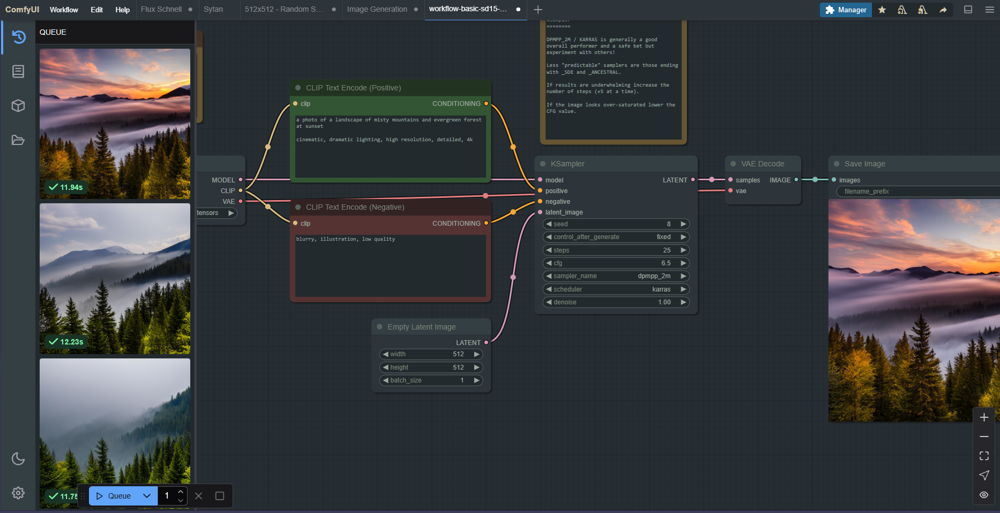

# everforest-ComfyUI
A Color Palette for ComfyUI based on the Everforest theme by @sainnhe

## Examples
---
### Dark
#### Medium:

---
### Light
Coming soon

## How to Install
 - Download your preferred style .json found within the folders
 - Within ComfyUI:
  - Open bottom left gear for settings
  - Click "Appearance"
  - Click the second icon (Import) on the "Color Palette" line at the top
  - Locate the .json you downloaded to apply
